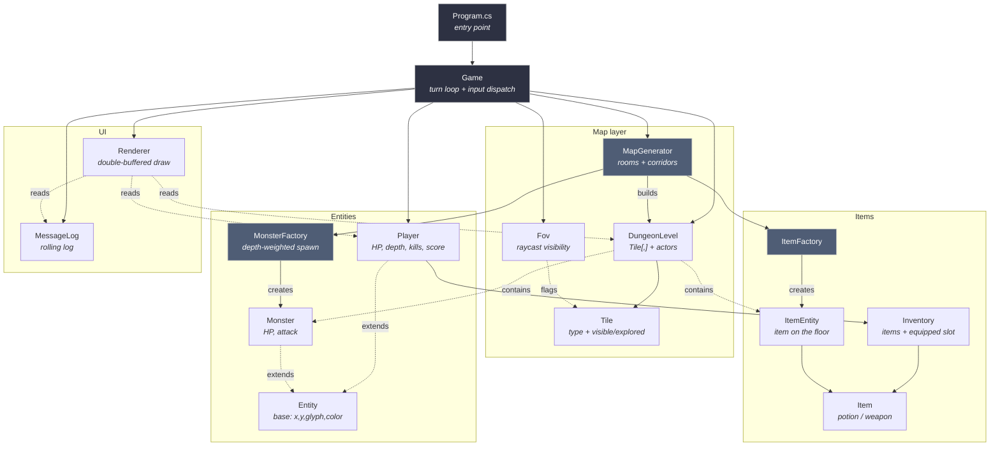
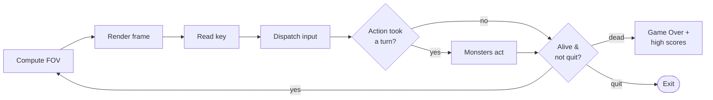

# Terminal Roguelike

A classic ASCII dungeon crawler in C# / .NET 10. Procedural rooms-and-corridors maps, fog of war, bump-to-attack combat, scaling monsters, endless descent. No external dependencies — just `System.Console`.

## Run it

```bash
dotnet run
```

Requires a real terminal (≥ **80×23**). The game uses `Console.ReadKey`, which doesn't work under piped stdin.

## Controls

| Key      | Action                          |
| -------- | ------------------------------- |
| Arrows   | Move (bump a monster to attack) |
| `g`      | Pick up item under you          |
| `i`      | Open inventory (letter to use)  |
| `>`      | Descend stairs                  |
| `q`      | Quit                            |

## Glyphs

🏃 you · `#` wall · `.` floor · `>` stairs down · 🧪 potion · ⚔️ weapon · 🐀 👹 ⚔️ 🐻 👻 💀 monsters (rat → goblin → orc → troll → wraith → Final Boss)

Bright tiles are in your field of view; dim tiles are explored but currently unseen.

## Architecture



### Turn loop



## Project layout

```
Program.cs            entry point
Game.cs               turn loop, input, combat, inventory screen, game over
Map/
  Tile.cs             TileType + visible/explored flags
  DungeonLevel.cs     grid + monster list + item list
  MapGenerator.cs     procedural rooms + L-shaped corridors
  Fov.cs              360-ray raycast field of view
Entities/
  Entity.cs           abstract base
  Player.cs           HP, attack, depth, kills, score, inventory
  Monster.cs          HP, attack
  MonsterFactory.cs   depth-weighted spawn table
Items/
  Item.cs             Item + ItemEntity + ItemFactory
  Inventory.cs        list + equipped weapon slot
UI/
  Renderer.cs         double-buffered draw (only redraws changed cells)
  MessageLog.cs       rolling buffer of recent actions
```

## Notes

- Combat damage is `attacker.Attack + rng[-1, 1]`, minimum 1.
- Monsters only act while in the player's FOV; outside it they idle.
- Movement is 4-directional for both player and monsters; melee requires orthogonal adjacency.
- `Score = Depth × 100 + Kills × 10`. Top 10 runs persisted to `highscores.txt`.
